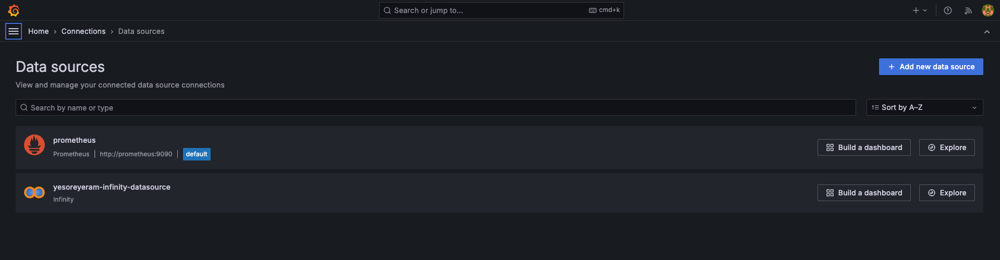

# Grafana configuration

1. Configure the data sources

2. Configure the prometheus data source

3. Set 3 dashboards

    - Grafana CSV INE
    

        - Query config (screenshot only shows 1, but data.csv contains info for Sexo = Total, Hombre and Mujer)
        

    - Grafana prometheus self monitoring
    

    - Grafana prometheus monitoring other apps
    

        - Query config
        
